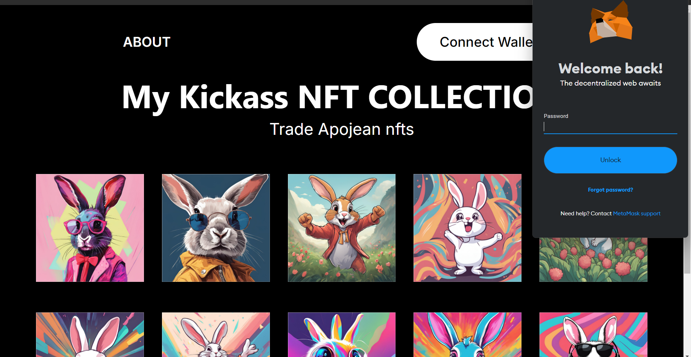
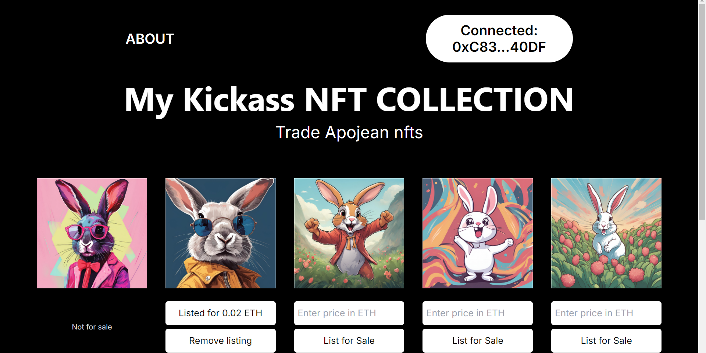
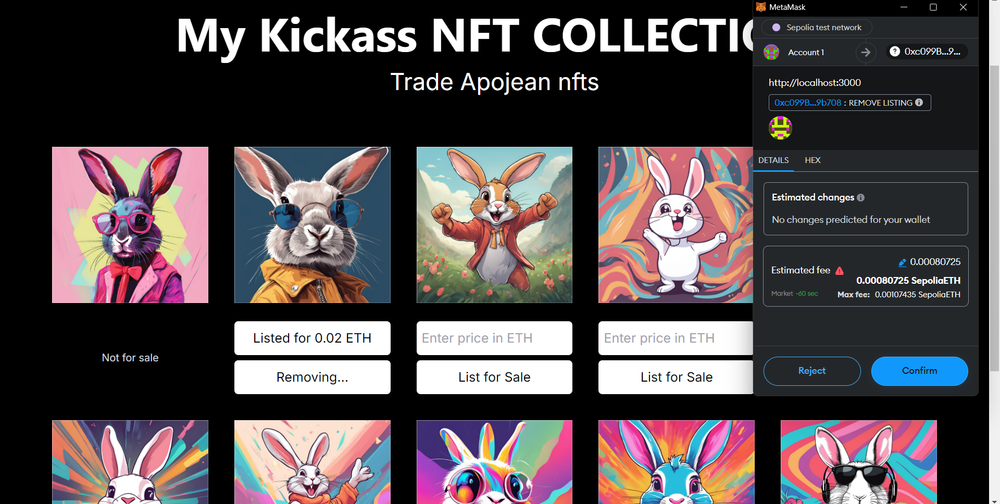

# X-NFT Collection

This project is an NFT collection by Abdullah Ozer. It uses Hardhat for deployment and `dotenv` for managing environment variables.

See the frontend connecting to the contract here:
https://xnft-acduae0fi-abdullah-ozers-projects.vercel.app/

## Prerequisites

Ensure you have the following installed:

- Node.js
- yarn

## Setup

1. Clone the repository:

    ```bash
    git clone https://github.com/abdullahozer11/x-nft.git
    cd x-nft
    ```

2. Install the dependencies:

    ```bash
    yarn install
    ```

3. Copy .env.sample to `.env` file in the root directory of the project and add the necessary environment variables:

# Testing

To run tests use:

```bash
  yarn test
```

# Running a node

To run a hardhat node:

```bash
  yarn run node
```

# Deploying

To deploy to hardhat node:

```bash
  npx hardhat run scripts/deploy.js
  npx hardhat run scripts/reserveNFTs.js
```

## Screenshots
Here are some screenshots from the project:




